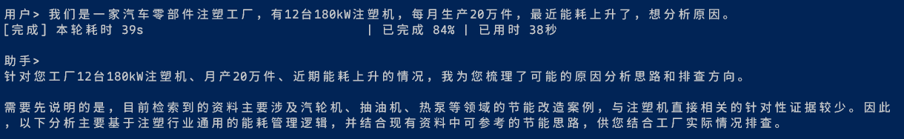
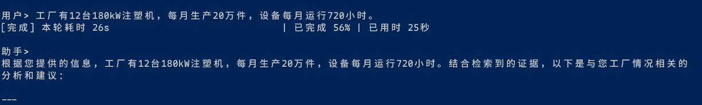
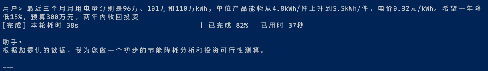

# ProcessAgent

ProcessAgent 是一个本地运行的通用企业场景决策 Agent。用户直接用自然语言描述问题，系统在多轮对话中识别行业、业务领域、企业事实、指标、目标和约束，并通过统一编排、知识检索、确定性计算和证据校验生成回答。

当前基础领域包括制造、零售、运输、医药、能源、建筑和金融。行业差异通过元数据、领域处理器和 Skill 参数表达

## 核心架构

```text
用户问题 → 会话记忆 → ScenarioIntentAgent
  → 行业/业务领域/场景路由 → ScenarioOrchestratorFacade
  → 8 个核心 Skill → 领域处理器 → 校验与自然语言回答
```

核心 Skill 固定为：

```text
retrieve   检索知识与证据
understand 提取实体、指标和参数
analyze    分析问题、适用性和风险
compare    比较方案、路线或选项
calculate  成本、收益、能源和排放计算
optimize   资源、流程、库存或路线优化
check      约束、合规和安全检查
verify     引用、证据和计算结果校验
```

制造业旧类名和旧 Skill 名称仍保留兼容入口；新编排统一使用通用 `ScenarioOrchestratorFacade` 和核心 Skill。

## 目录结构

```text
ProcessAgent/
├── backend/app/harness/      # 通用意图、编排、Skill 和领域处理器
├── backend/app/memory/       # 会话、用户和企业事实记忆
├── backend/app/pipeline/     # 文档解析、切分和索引
├── backend/app/retrieval/    # BM25、向量和混合检索
├── backend/app/storage/      # SQLite 等本地存储
├── backend/scripts/           # CLI 与数据处理脚本
├── backend/tests/             # 单元和工作流测试
├── manufacturing-data/       # 当前本地知识资料
└── local-data/               # SQLite 与 Chroma 本地数据
```

## 本地运行

```powershell
conda activate medix-swarm
cd D:\workfile\ProcessAgent
python -m pip install -r requirements.txt
# 在 .env 中配置可用的 DEEPSEEK_API_KEY、模型和 Embedding
cd backend
python -m scripts.run_manufacturing_agents
```

直接传入问题：

```powershell
python -m scripts.run_manufacturing_agents "某零售门店库存周转率低，如何分析"
```

## 验证

```powershell
conda activate medix-swarm
cd D:\workfile\ProcessAgent
python -m pytest backend/tests/test_scenario_routing.py backend/tests/test_task_executor.py -q
```

Embedding、SQLite、Chroma 和知识资料默认保留在本机。当前版本是可运行的通用编排基础版本；跨行业知识元数据、完整行业规则、系统性行业评测和生产级监控仍在建设中。

# agent功能梳理

| Agent | 作用 | 是否使用知识库 |
| --- | --- | --- |
| ScenarioIntentAgent | 识别行业、业务领域、场景类型、目标、约束、复杂度和缺失信息；区分能力询问、闲聊和业务问题 | 否 |
| EnterpriseContextAgent | 将用户在多轮对话中提供的企业、门店、仓库、车辆、工厂、设备、流程和指标整理为场景上下文 | 否 |
| LeadAgent | 根据问题复杂度和场景生成任务依赖，决定需要哪些核心 Skill | 间接，通过任务规划调用 Skill |
| VerifierAgent | 检查任务结果、证据来源、文档编号、页码、原文片段和计算结果 | 不主动检索，负责校验结果 |
| OrchestratorAgent | 汇总任务和领域处理器结果，组织自然语言回答，并记录编排信息和执行 Trace | 间接，汇总检索和 Skill 结果 |

# skills功能梳理

### 1. 核心 Skill

| Skill | 作用 |
| --- | --- |
| retrieve | 统一检索知识、案例和文档证据，返回来源、chunk 和页码 |
| understand | 提取企业实体、业务指标、工艺参数和缺失信息 |
| analyze | 分析问题、趋势、根因、适用性、风险和合规条件 |
| compare | 比较技术方案、供应商、路线或经营选项 |
| calculate | 通过 `calculation_type` 计算成本、收益、能源、排放、运输和 ROI |
| optimize | 优化库存、流程、设备、资源、排班或运输路线 |
| check | 检查预算、回收期、质量、安全、法规和其他约束 |
| verify | 校验引用、证据、版本和计算结果 |

典型流程：

```text
用户问题
→ ScenarioIntentAgent 识别行业和业务领域
→ ScenarioSkillMatcher 选择核心 Skill
→ TaskExecutor 执行核心 Skill 和领域处理器
→ VerifierAgent 校验证据与计算
→ OrchestratorAgent 组织回答
```

### 2. 领域处理器

领域处理器不是独立 Agent，而是由核心 Skill 调用的行业规则和指标实现。当前每个细分领域保持 1～2 个处理器：

| 行业 | 领域处理器 |
| --- | --- |
| 制造 | `manufacturing_process`、`manufacturing_equipment` |
| 零售 | `retail_inventory`、`retail_store` |
| 运输 | `transport_fleet`、`transport_route` |
| 医药 | `pharma_quality`、`pharma_compliance` |
| 能源 | `energy_asset`、`energy_emissions` |
| 建筑 | `construction_project`、`construction_safety` |
| 金融 | `finance_operations`、`finance_risk_compliance` |

### 3. 兼容入口

旧制造业 Skill 名称仍可调用，但只用于兼容历史任务和测试：

| 旧名称 | 核心 Skill |
| --- | --- |
| `search_manufacturing_knowledge` | `retrieve` |
| `extract_process_parameters` | `understand` |
| `check_applicability` | `analyze` |
| `compare_technical_options` | `compare` |
| `calculate_energy_savings` | `calculate` |
| `verify_citations` | `verify` |

新代码和新任务规划应使用 8 个核心 Skill，并通过 `operation`、`analysis_type` 或 `calculation_type` 指定具体动作。

## 数据私有

ProcessAgent 默认采用本地数据存储和本地向量索引：

- 原始知识文档保留在本机，不自动上传到第三方知识库。
- SQLite、Chroma 和会话记忆默认保存在项目的 `local-data/` 目录。
- 用户事实、企业上下文、检索证据和计算结果按不同来源记录。
- DeepSeek LLM、语义 Embedding 和本地知识库都是强制运行依赖；任一启动检查失败时服务不会进入就绪状态。
- 配置外部模型时，仅发送当前任务所需的问题、必要上下文和检索证据。

生产部署仍应根据企业安全要求补充磁盘加密、访问控制、日志脱敏、备份恢复、网络出口控制和多租户数据隔离。

## 当前边界

- 当前重点是本地 CLI 和通用 RAG/Agent 主流程。
- 各行业领域处理器已经具备基础可执行逻辑，但部分复杂业务规则仍在完善。
- 跨行业知识库元数据过滤、版本失效治理和完整行业资料建设尚未全部完成。
- Web、正式 API、可视化管理和生产级权限体系不作为 CLI 运行前提。
- 当前测试覆盖核心路由和执行链路，尚未完成所有行业的系统性问题集验收。

## 未来优化方向

### 1. 意图识别与路由

- 增加低置信度分类复核。
- 更准确地区分新问题和补充上一轮信息。
- 扩展行业、业务领域、对象、指标和场景类型识别。

### 2. 上下文与记忆

- 完善门店、库存、车辆、路线、批次、能源资产、建筑项目和金融主体记忆。
- 分离用户事实、助手回答、检索证据、计算结果和模型推断。
- 增加事实来源、置信度、有效期、修正和删除机制。

### 3. 核心 Skill 与领域逻辑

- 继续统一 8 个核心 Skill 的输入、输出、单位和错误协议。
- 增强零售补货、运输路线、医药 GMP、能源项目、建筑风险和金融合规逻辑。
- 为领域处理器补充可复核的计算公式和业务约束。

### 4. 知识库与检索

- 增加行业、领域、对象、流程、指标、来源机构、适用地区和有效期过滤。
- 完善文档版本链、替代标准、失效文档降权和增量更新。
- 建立零售、运输、医药、能源、建筑和金融知识包。

### 5. 可靠性与评测

- 增加 Skill 超时、重试、降级和依赖失败处理。
- 建立跨行业意图、路由、计算、记忆、引用和检索评测集。
- 记录 Agent/Skill 耗时、失败率、检索质量和调用成本。

### 6. 产品化

- 让 CLI、API 和 Web 共用同一套 `ScenarioOrchestratorFacade`。
- 增加流式进度、执行 Trace、来源展示和结果导出。
- 提供文档上传、重新解析、知识库管理和企业场景可视化能力。

# 运行示例

```
测试用语：
  第一轮 我们是一家汽车零部件注塑工厂，最近能耗上升了，想分析原因。

  第二轮 工厂有12台180kW注塑机，每月生产20万件，设备每月运行720小时。

  第三轮 最近三个月月用电量分别是96万、101万和110万kWh，单位产品能耗从4.8kWh/件上升到5.5kWh/件，电价0.82元/kWh。希望一年降低15%，预算
  300万元，两年内收回投资。
```

##### 第一轮



详细回答：

```
用户> 我们是一家汽车零部件注塑工厂，有12台180kW注塑机，每月生产20万件，最近能耗上升了，想分析原因。
[完成] 本轮耗时 39s                              | 已完成 84% | 已用时 38秒

助手>
针对您工厂12台180kW注塑机、月产20万件、近期能耗上升的情况，我为您梳理了可能的原因分析思路和排查方向。

需要先说明的是，目前检索到的资料主要涉及汽轮机、抽油机、热泵等领域的节能改造案例，与注塑机直接相关的针对性证据较少。因此，以下分析主要基于注塑行业通用的能耗管理逻辑，并结合现有资料中可参考的节能思路，供您结合工厂实际情况排查。

---

### 一、能耗上升的常见原因排查方向

建议从以下五个维度逐项排查，优先检查数据记录和现场可观察项：

**1. 生产排程与设备利用率变化**
- 检查近期订单结构是否变化（如小批量、多品种切换增多），导致注塑机频繁空转或待机时间延长。
- 确认每台机的实际运行小时数、待机时间占比是否较之前增加。

**2. 设备状态与维护情况**
- 注塑机液压系统、螺杆、料筒等部件磨损会导致效率下降、能耗上升。检查近期是否有设备出现异常振动、噪音或温升。
- 确认液压油是否到期未更换、油温是否过高（油温升高会显著增加液压泵功耗）。
- 检查加热圈、热电偶是否老化或失效，导致加热效率降低、保温时间延长。

**3. 工艺参数调整**
- 对比近期与之前的工艺参数记录（如料温、模温、注射压力、保压时间、冷却时间等），确认是否有调整导致能耗增加。
- 检查模具冷却水路是否堵塞或结垢，影响冷却效率，延长成型周期。

**4. 原材料批次变化**
- 不同批次的塑料原料（如熔指、含水率差异）可能需要更高的加工温度或更长的干燥时间，间接推高能耗。

**5. 环境因素**
- 夏季环境温度升高，会导致设备散热变差、冷却系统负荷增加，从而推高总能耗。可对比去年同期数据判断是否存在季节性因素。


### 二、建议的排查步骤

1. **建立能耗基线**：调取近6-12个月每台注塑机的电表数据，按“单件产品能耗（kWh/件）”或“每吨原料能耗”计算单位能耗，找出能耗上升是从哪个月、哪几台设备开始。
2. **现场巡检**：重点检查液压系统油温、加热系统工作状态、冷却水系统流量与温度。
3. **数据对比**：将近期单位能耗与去年同期、上季度进行对比，排除季节性影响。
4. **记录分析**：核对生产排程记录、设备维修记录、工艺参数变更记录，找出与能耗上升时间点吻合的变动。


### 三、关于节能改造的参考信息

虽然现有资料中没有注塑机直接相关的案例，但其中关于**设备运行效率提升**的思路可供参考。例如，资料中提到汽轮机变工况运行改造技术，通过重新设计运行参数、优化通流结构，可使机组运行效率不低于出厂新机设计值，节能效率约6%~10%（来源：b1bc415a07a62bd4，第4页）。这一思路的核心是**让设备运行参数与实际工况匹配**，对注塑机而言，可类比为：

- 检查注塑机电机是否长期处于“大马拉小车”状态（即电机功率远大于实际负载需求），可考虑加装变频器或伺服节能改造。
- 优化加热系统保温，减少热量散失。

但请注意，上述改造效果为其他行业的案例数据，**不能直接作为您工厂的预期节能效果**，具体收益需根据您工厂的实际工况评估。


### 四、需要您补充的信息

为了更精准地定位问题，建议您提供以下数据（如有）：

1. 能耗上升的具体数值和起始时间（如“近3个月总用电量环比增加15%”）。
2. 同期产量变化情况（产量是否同步增加）。
3. 近期是否有设备维修、工艺调整、原料更换等事件。
4. 是否有分设备或分车间的电表计量数据。

---

**总结**：能耗上升大概率与生产排程、设备维护状态或工艺参数变化有关，建议先按上述方向排查，建立单位能耗基线后再判断是否需要设备改造。如有进一步数据，我可以帮您做更具体的分析。
```

##### 第二轮



```
用户> 工厂有12台180kW注塑机，每月生产20万件，设备每月运行720小时。
[完成] 本轮耗时 26s                              | 已完成 56% | 已用时 25秒

助手>
根据您提供的信息，工厂有12台180kW注塑机，每月生产20万件，设备每月运行720小时。结合检索到的证据，以下是与您工厂情况相关的分析和建议：

---

**一、当前证据与您工厂的匹配度**

检索到的5条证据主要涉及装载机再制造、汽轮机组改造、电机节能改造、氮化炉改造和废旧轮胎处理等场景，**与注塑机生产场景的直接匹配度较低**。具体来看：

1. **电机再制造/特制电机技术**（来源：e25b69d7d43b6856，第5页）——该证据提到低效三相异步电动机的再制造和特制电机技术，适用于电机系统节能改造。注塑机的主要动力源是液压系统和伺服电机，如果您的注塑机使用的是老旧低效电机，这部分技术有一定参考价值，但证据中的案例（每天节电3168kWh）来自其他行业，**不能直接套用为您的节电预期**。

2. **装载机再制造案例**（来源：66776cd08a781e21，第10页）——涉及液压阀体、油缸等部件的再制造修复，与注塑机的液压系统有一定技术相通性，但应用场景（港口装载机）差异较大，仅可作为设备维护思路的参考。

3. **汽轮机组改造、氮化炉改造、废轮胎处理**等证据与注塑机生产**基本不相关**，不建议采用。

---

**二、基于您工厂数据的初步测算**

根据您提供的基础数据：

- 12台注塑机 × 180kW = **总装机容量2160kW**
- 每月运行720小时，则月理论最大用电量为：2160kW × 720h = **1,555,200 kWh（约155.5万度/月）**
- 年产20万件/月，单件产品分摊的设备能耗约为 **7.78 kWh/件**（此为理论满负荷值，实际因负载率、待机时间等因素会低于此数）

**注意**：以上为基于装机容量的理论估算，实际用电量取决于设备负载率、加热系统效率、液压系统能耗等，需要以企业实际电表数据为准。

---

**三、建议的节能方向（基于证据的合理延伸）**

虽然检索到的案例不能直接套用，但结合注塑机行业的一般经验和证据中提到的技术思路，以下方向值得关注：

1. **电机系统升级**（有证据支撑）：如果注塑机配备的是老旧三相异步电机，可考虑更换为高效电机或伺服电机。证据中提到的特制电机技术（低损耗硅钢片、优化绕组设计等）可提升电机效率（来源：e25b69d7d43b6856，第5页）。注塑机伺服改造通常可节能20%-50%，但**具体节电率需根据设备现状评估，不能直接引用其他行业案例的数字**。

2. **设备维护与再制造**（有证据支撑）：参考装载机再制造案例中对液压阀体、油缸的修复方式（超声波清洗、激光熔覆等），注塑机的液压系统也可以通过定期维护和部件修复来减少内泄漏、提升效率（来源：66776cd08a781e21，第10页）。但该案例的效果数据（性能与新品一致、维修费大幅降低）来自装载机场景，**仅作为维护思路参考**。

3. **生产管理优化**（无直接证据，属一般经验）：注塑机在待机、换模、加热保温阶段的能耗占比可观，优化排产、减少空转、做好保温等措施可降低单位产品能耗。

---

**四、需要补充的信息**

要给出更精准的节能分析和投资建议，建议补充以下数据：

- 企业当前的实际月用电量（电费账单）
- 注塑机类型（液压机/伺服机/全电动机）及机龄
- 主要生产的产品类型和工艺特点（如是否需要高温、高压、长保压时间等）
- 设备负载率（实际运行功率/额定功率）
- 是否有已实施的节能措施

---

**总结**：当前检索到的证据与注塑机场景匹配度有限，无法直接给出量化的节电方案。建议以企业实际能耗数据为基础，优先关注电机系统升级和设备维护两个方向，并补充上述信息后做进一步分析。
```

##### 第三轮



```
用户> 最近三个月月用电量分别是96万、101万和110万kWh，单位产品能耗从4.8kWh/件上升到5.5kWh/件，电价0.82元/kWh。希望一年降低15%，预算300万元，两年内收回投资
[完成] 本轮耗时 38s                              | 已完成 82% | 已用时 37秒

助手>
根据您提供的数据，我为您做一个初步的节能降耗分析和投资可行性测算。

---

## 一、当前能耗基线分析

**近三个月用电情况：**
- 月用电量：96万、101万、110万 kWh，呈明显上升趋势
- 三个月合计约307万 kWh，月均约102.3万 kWh
- 年化用电量约 **1228万 kWh**（按当前月均推算）

**单位产品能耗：**
- 从4.8 kWh/件上升到5.5 kWh/件，上升幅度约14.6%
- 按电价0.82元/kWh计算，单件产品电费成本从3.94元升至4.51元

**当前年电费支出估算：**
- 1228万 kWh × 0.82元 ≈ **1007万元/年**

---

## 二、节能目标测算

**目标：一年降低15%**

- 目标年节电量：1228万 × 15% ≈ **184万 kWh/年**
- 目标年节约电费：184万 × 0.82 ≈ **151万元/年**

**投资约束：**
- 预算上限：300万元
- 回收期要求：≤2年
- 即：年节约金额需 ≥ 150万元（300万 ÷ 2年）

**结论：** 您的节能目标（年省151万元）与投资回收期约束（年省≥150万元）基本吻合，目标设定合理，但要求较高，需要组合多种措施才能实现。

---

## 三、单位产品能耗上升的可能原因

在制定方案前，建议先排查能耗上升的原因，常见因素包括：

1. **生产排程变化**：班次增加、产量波动、设备空转时间延长
2. **设备老化或维护不足**：电机效率下降、传动系统磨损、压缩空气泄漏
3. **工艺参数漂移**：温度、压力、周期等未处于最优区间
4. **原材料批次变化**：来料品质波动导致加工能耗增加
5. **环境因素**：季节温度变化影响制冷/加热负荷
6. **计量口径变化**：产量统计方式或产品结构变化

> ⚠️ 目前缺少上述维度的具体数据，建议先做一次能耗审计，明确能耗上升的根因，再针对性投入。

---

## 四、可参考的节能措施及案例

根据检索到的节能技术案例，以下几类措施与您的场景可能相关：

### 1. 电机系统节能改造
- **技术原理**：采用低损耗硅钢片、优化绕组设计、降低定子铜耗和铁耗，综合提升电机效率
- **参考案例**：某案例中设备平均日节电3168 kWh，年节电约162.2万 kWh，年效益81.1万元，总投入92.16万元，回收期约1.1年（来源：e25b69d7d43b6856，p5）
- **适用性**：如果您的产线有大量电机长期运行，此项措施回收期短、见效快

### 2. 电能质量治理（无功补偿/谐波治理）
- **技术原理**：通过同步编码开关过零投切电容器，补偿无功功率、调节三相平衡，降低线损和变压器损耗
- **参考案例**：某项目年效益18万元，总投入45万元，回收期约2.5年（来源：5771f0a1c8b25e98，p10）
- **适用性**：适合配电系统功率因数偏低、三相不平衡明显的场景

### 3. 智慧能源管理/微电网系统
- **技术原理**：通过统一调度光伏、储能与电网供电，提高系统可靠性与经济性
- **参考案例**：某园区项目综合年效益252万元，总投入1203万元，回收期约4.8年（来源：cf6401607a035c93，p7）
- **注意**：此类项目投资较大、回收期较长，**单独实施难以满足您2年回收的要求**，但可作为长期规划

### 4. 压缩空气系统优化
- **参考案例**：某电解铝企业改造打壳系统后，压缩空气用量从112.6万m³/槽·天降至50.8万m³/槽·天，单槽年节约用电约7万kWh，项目年效益227.25万元，总投入166.5万元，回收期仅9个月（来源：8adb714be74c9bac，p5）
- **适用性**：如果您的产线有压缩空气系统，泄漏治理和用气优化通常是性价比最高的切入点

> ⚠️ **重要说明**：以上均为外部案例数据，仅作参考。实际效果需结合贵司设备状况、运行负荷、生产节拍等因素重新测算，不能直接套用。

---

## 五、建议的推进路径

### 第一阶段：能耗审计（1-2个月）
- 排查单位产品能耗上升的根因（排程、设备、工艺、原料等）
- 对主要耗能设备（电机、空压机、加热/制冷系统）进行能效检测
- 建立分项计量，明确各环节电耗占比

### 第二阶段：优先实施低成本高回报措施（3-6个月）
- **压缩空气系统治理**（泄漏修复、压力优化）：通常回收期最短
- **电机能效提升**（更换高效电机或加装变频器）：回收期约1-2年
- **电能质量治理**（无功补偿）：回收期约2-3年

### 第三阶段：系统性优化（6-12个月）
- 能源管理系统（EMS）建设，实现精细化管控
- 结合生产排程优化，削峰填谷，降低需量电费
- 视条件评估光伏等分布式能源（注意回收期较长）

---

## 六、结论

| 项目 | 数值 |
|------|------|
| 年化用电量（估算） | 约1228万 kWh |
| 年电费支出（估算） | 约1007万元 |
| 15%节能目标 | 年省约184万 kWh / 151万元 |
| 预算上限 | 300万元 |
| 回收期要求 | ≤2年（年省需≥150万元） |

**总体判断：** 目标与预算约束基本匹配，但实现难度较大，建议：

1. **先做能耗审计**，明确能耗上升根因，避免盲目投资；
2. **优先选择回收期短的措施**（压缩空气、电机改造等），组合实施以达到年省150万元的目标；
3. **大型投资（如微电网、储能）单独无法满足2年回收期要求**，需谨慎评估或作为长期规划。

如需进一步细化方案，建议提供：主要耗能设备清单、生产班次与产量数据、是否使用压缩空气、配电系统基本情况等信息。
```

